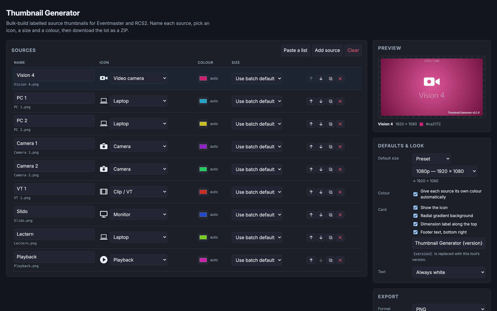

# Thumbnail Generator user guide

**Bulk-build labelled source thumbnails for Barco Eventmaster and Analog Way RCS2.** Type a list of
sources, pick an icon, a size and a colour for each, and download the lot as a ZIP with one image
per source, named after it.

Runs entirely in the browser. Nothing is uploaded; the batch you build is saved in the browser's
local storage, so it survives closing the tab.

> **Before you rely on this:** the cards are built and checked in a browser with 128 tests behind
> them — they render at their true raster, long names shrink and then wrap to two lines inside the
> margins, odd rasters such as 2056×1329 lay out correctly, and the PNG encoder produces a valid
> file whose header matches the canvas.
>
> **No output has ever been loaded onto an Eventmaster or a LiveCore frame.** PNG is a reasonable
> assumption about what those accept rather than a measurement, and the size presets are generic
> rather than taken from either vendor's documentation.
>
> This codebase was created with AI assistance, directed and reviewed by a human author.

---

## What a card looks like

A radial gradient in the source's colour, a white knockout icon, and the source name below it.
Optionally a dimension label along the top (`1920 x 1080`) and a footer bottom-right — both on by
default and both switchable.

---

## Using it

1. **Add sources.** One at a time, or *Paste a list* and drop in a column straight out of a patch
   sheet — newline or comma separated.
2. **Set the icon** per source: camera, video camera, projector, monitor, laptop, desktop, tablet,
   phone, USB stick, drive, playback, clip, slides, microphone, speaker, server, network, web, or
   none.
3. **Set the size.** 1080p by default; per source you can override with a preset, an exact pixel
   size, or an aspect ratio plus a long edge.
4. **Set the colour**, or leave *Give each source its own colour* on and let it spread them around
   the hue wheel.
5. **Generate.** You get a ZIP of images plus a `manifest.csv` listing which file went with which
   source, at what size and colour.

---

## Importing a list

Three ways in: a **CSV file**, a **paste** (copying straight out of a spreadsheet arrives as
tab-separated and is handled), or a **published Google Sheet**.

Four columns, of which **only `name` is required**. A blank cell means "use the batch default".

| Column | Accepts |
| --- | --- |
| `name` | Anything. Also matches a heading called source, label, input, title. |
| `icon` | An icon name (`camera`, `Video camera`, `usb`) or a synonym — `cam`, `PC`, `MacBook`, `screen`, `VT`, `PowerPoint`, `SSD`. |
| `colour` | `#1f6fd0`, `1f6fd0`, `#f00`, or a name: red, amber, teal, navy, magenta and the rest. |
| `size` | `1920x1080`, a ratio `16:9`, a ratio with a long edge `16:9@2560`, or a preset `1080p` / `4K` / `720p`. |

Headings are matched loosely — `Source Name`, `source_name` and `SOURCE NAME` all work, in any
column order. **If no heading is recognised the columns are read in order** as name, icon, colour,
size, which is what a bare list pasted from one column actually is.

**Nothing is applied until you have seen what parsed.** The preview says how many sources it found,
which heading it took each column from, which headings it ignored, and **every value it could not
understand — with the spreadsheet row number**, so you can go and fix it. Values it cannot read fall
back to the batch default and are listed; **they are never silently guessed at.**

**On the Google Sheet route:** the plumbing is verified from the deployed site, but **a genuinely
published sheet returning its rows has not been tested** — that needs a real Google account. If it
misbehaves, the file and paste routes need no network at all.

---

## Filenames

The label on the card and the name of the file are the same string.

**Names are made unique before packing** — two sources called "Laptop" become `Laptop.png` and
`Laptop-2.png`, because a ZIP with duplicate names extracts to one file and **silently loses a
card.**

**Safe filenames** (in Export) folds everything to ASCII with underscores for spaces. Use it when
the files are going straight onto a frame rather than onto a computer.

---

## Formats, and the size trap

PNG by default; JPEG with a quality slider is also there.

> **A gradient card is about 25× bigger as a PNG than as a JPEG** — a 2056×1329 card measures
> ~2.5 MB against ~93 KB. Browsers dither smooth gradients, which leaves PNG's compression nothing
> to work with. **A 48-source batch of PNGs is around 100 MB.**

The export tells you the archive size before you commit to it. **Turning the gradient off brings
PNG back down to a few kilobytes** — which is the right answer when the frame only needs a legible
label.

---

## One thing worth knowing

Output is **not byte-identical across machines**, because the card uses a system font stack rather
than a bundled one. Immaterial for labels like "PC 2"; worth knowing if you ever diff two machines'
output.

---

## If something is wrong

| Symptom | Cause |
| --- | --- |
| **A source is missing from the ZIP** | It should not be — duplicate names are made unique before packing. Check the manifest. |
| **The archive is enormous** | Gradient cards as PNG. Turn the gradient off, or export JPEG. |
| **A value was ignored on import** | The preview lists every one it could not read, with its row number. Nothing is guessed. |
| **The Google Sheet import returns nothing** | That route is the least tested. Use the file or paste route. |
| **The frame will not take the file** | PNG is an assumption here, not a measurement. |
